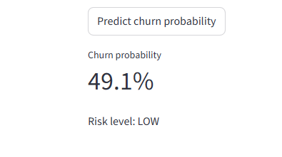
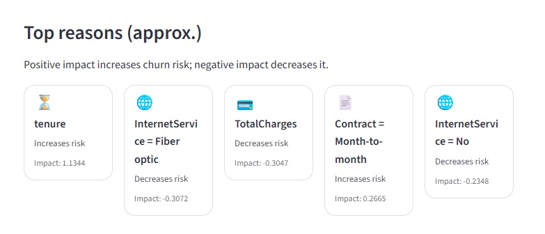
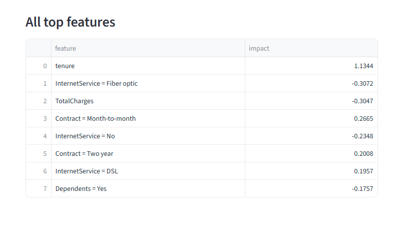

## 🚀 Live Demo
👉 https://churn-ml-shap.streamlit.app/

Interactive Streamlit app for customer churn prediction with SHAP-based explainability.


\# Customer Churn Prediction (Explainable ML + Streamlit)


An end-to-end machine learning project that predicts customer churn probability and explains the key drivers behind each prediction using SHAP. Includes a Streamlit demo with a simple UI and explainability cards.


\## Demo

\- Run locally (instructions below)

\- (Optional) Deploy on Streamlit Community Cloud after pushing to GitHub


\## What this project includes

\- \*\*Model training\*\* with scikit-learn Pipeline (preprocessing + Logistic Regression)

\- \*\*Explainability\*\* with SHAP (top drivers per customer)

\- \*\*Interactive UI\*\* built with Streamlit (probability, risk label, top reasons cards)

\- \*\*Clean repo structure\*\* and reproducible setup via `requirements.txt`


\## Dataset

\- Telco Customer Churn dataset (Kaggle)

\- The raw dataset is not committed to the repository.


\## Project structure

```text

churn-ml/

├── app/

│   └── app.py

├── src/

│   └── train.py

├── notebooks/

├── requirements.txt

└── .gitignore


How to run locally (Windows)


Create and activate a virtual environment:


python -m venv .venv

.venv\\Scripts\\activate


Install dependencies:


pip install -r requirements.txt


Train the model (creates models/churn\_pipeline.joblib):


python src/train.py


Start the Streamlit app:


streamlit run app/app.py


Open the Local URL shown in the terminal (usually http://localhost:8501).


Explainability (SHAP)


The app displays the top features driving the prediction for the selected customer:


Positive impact → increases churn risk


Negative impact → decreases churn risk









Notes


Preprocessing is handled inside the scikit-learn Pipeline (no separate processed files required).


This project can be extended with model comparison (e.g., XGBoost), threshold tuning, and monitoring.


